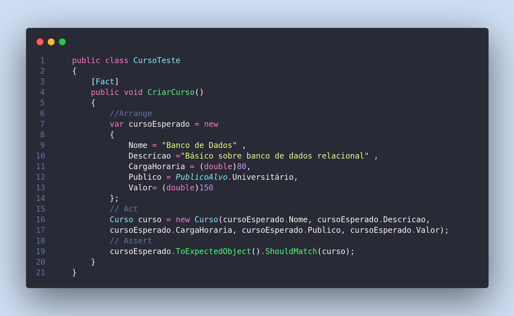

## Problema encontrado no código

Nesse código acima, está sendo usado a biblioteca ExpectedObjects para realizar testes em uma classe `Curso`. No entanto, há um problema na definição do objeto anônimo `cursoEsperado`, especificamente no atributo `CargaHoraria`, onde a tipagem não está clara, e isso causa um erro durante a comparação com o objeto real `Curso`. O atributo `Valor` não apresenta esse problema porque seu valor é definido explicitamente como `150.00`, o que indica a tipagem correta como um número decimal (double).

Para resolver esse problema, você deve garantir que a tipagem dos atributos no objeto anônimo corresponda à tipagem dos atributos na classe `Curso`. Para o atributo `CargaHoraria`, você pode definir explicitamente seu tipo como `double` da seguinte maneira:

### Primeira forma de fazer
```csharp
var cursoEsperado = new
{
    Nome = "Banco de Dados",
    Descricao = "Básico sobre banco de dados relacional",
    CargaHoraria = 80.0, // Definindo a tipagem como double
    Publico = PublicoAlvo.Universitário,
    Valor = 150.00
};
```
### Segunda forma de fazer
```csharp
var cursoEsperado = new
{
    Nome = "Banco de Dados",
    Descricao = "Básico sobre banco de dados relacional",
    CargaHoraria = (double)80, // Definindo a tipagem como double
    Publico = PublicoAlvo.Universitário,
    Valor = (double)150
};
```

Dessa forma, você está especificando claramente que `CargaHoraria` é do tipo `double`, correspondendo à tipagem correta na classe `Curso`. Com essa alteração, o erro de tipagem ao comparar o objeto `cursoEsperado` com a instância real de `Curso` será resolvido.

