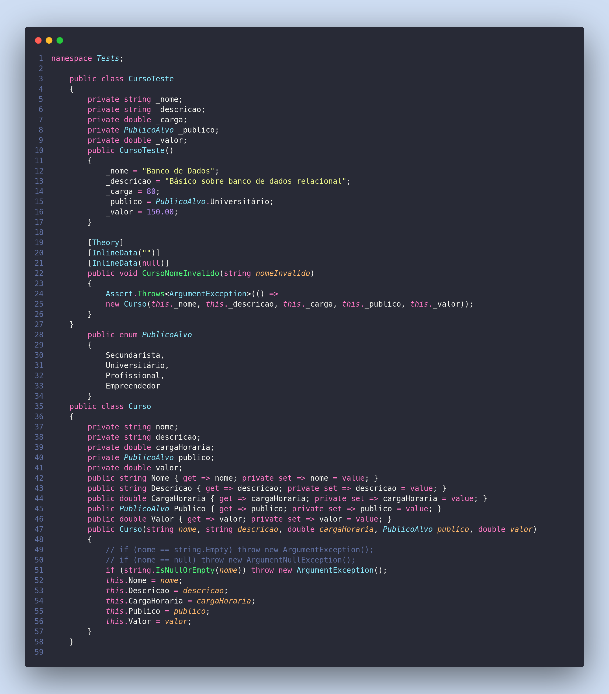

4 – O teste apresentado abaixo, da maneira que está, nunca retornará o status de sucesso em sua realização. Por
quê?



Problemas nesse código acima são:

1 - Não tem um fact que cria o objeto ou seja já nunca vai retornar o status dde verde no teste -> na verdade nem vai conseguir roda o teste unitário. Essa é a primeira diferença na classe curso teste onde ele define valores para as variaveis porém faltou o **fact** e criar o objeto e realizar a comparação. Faltou a estrutura do AAA -> Arrange -> Act -> Assert. 

```csharp
    public class CursoTeste
    {
        private string _nome;
        private string _descricao;
        private double _carga;
        private PublicoAlvo _publico;
        private double _valor;

        public CursoTeste()
        {
            _nome = "Banco de Dados";
            _descricao = "Básico sobre banco de dados relacional";
            _carga = 80;
            _publico = PublicoAlvo.Universitário;
            _valor = 150.00;
        }

        [Fact]
        public void criarCurso()
        {
            //Arrange
            var cursoEsperado = new
            {
                _nome = "Banco de Dados";
                _descricao = "Básico sobre banco de dados relacional";
                _carga = 80;
                _publico = PublicoAlvo.Universitário;
                _valor = 150.00;
            };
            //Act
            Curso curso - new Curso(cursoEsperado._nome, cursoEsperado._descricao, cursoEsperado._carga, cursoEsperado._publico, cursoEsperado._valor);
            //Assert
            cursoEsperado.ToExpectedObject().ShouldMatch(curso);
        }
    }
```

2 - Parâmetro errado:
```csharp
    [Theory]
    [InlineData("")]
    [InlineData(null)]
    public void CursoNomeInvalido(string nomeInvalido)
    {
        Assert.Throws<ArgumentException>(() =>
        new Curso(this._nome, this._descricao, this._carga, this._publico, this._valor));
    }
```

Outro problema aqui é que foi passado o parametro errado para o objeto curso -> essa classe de teste é para testar se o nome é invalido ou seja tenho que passar esse parametro **nomeInvalido** ao invés de this._nome.


