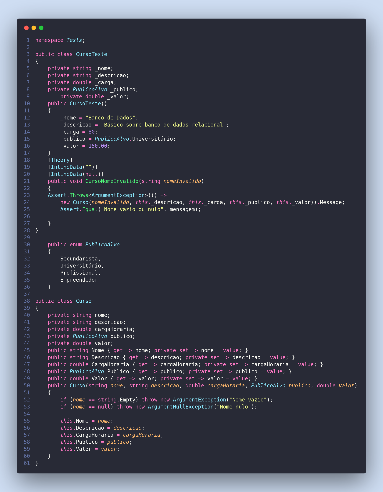

5 – Existem 2 tipos de erros nas classes abaixo que não permitem que o teste seja executado quando compilado.
Encontre os erros e corrija-os escrevendo ao lado a solução.



Erro está na Classe de teste CursoNomeInvalido onde faltou armazenar a mesangem em uma variável e Por que a classe Curso está lançando as exeções separadas sendo assim o teste está falhando. -> Aqui seria o que a classe curso deveria retornar -> Nome vazio ou nulo.


```csharp

    public void CursoNomeInvalido(string nomeInvalido)
    {
    var mensagem = Assert.Throws<ArgumentException>(() =>
        new Curso(nomeInvalido, this._descricao, this._carga, this._publico, this._valor)).Message;
        Assert.Equal("Nome vazio ou nulo", mensagem);

    }

    public Curso(string nome, string descricao, double cargaHoraria, PublicoAlvo publico, double valor)
    {   
        // if (nome == string.Empty) throw new ArgumentException("Nome vazio");
        // if (nome == null) throw new ArgumentNullException("Nome nulo");
        if(string.IsNullOrEmpty(nome)) throw new ArgumentException("Nome vazio ou nulo");
        this.Nome = nome;
        this.Descricao = descricao;
        this.CargaHoraria = cargaHoraria;
        this.Publico = publico;
        this.Valor = valor;
    }

```

