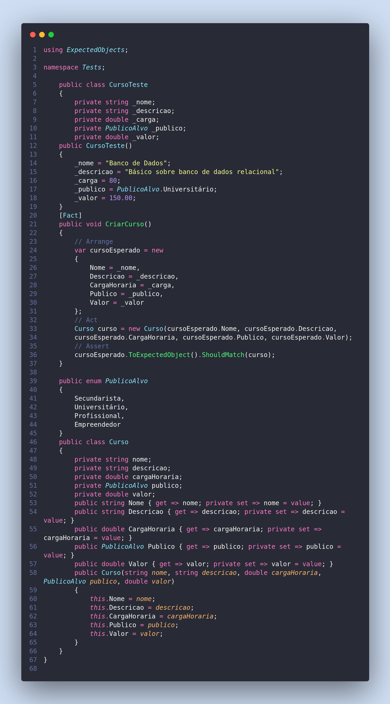

3 – Explique o conceito de Expected Object, que é demonstrado no teste abaixo.

Expected Object é um biblioteca do dotnet onde ele compara um objeto como um todo, diferente do modelo dos assert que se eu usar vários assert para comprar um objeto que tenha mais de um atributo ao testar você não ira saber aonde exatamente o problema ocorreu isso olhando pra um teste que usam mais de um assert.
Já o  objeto ExpectedObjects ele compara um objeto inteiro apenas com uma linha e gera um exeção caso alguns do atributos desse objeto não estiver conforme.
Ponto a ressaltar é que essa exeção é gerada conforme o atributo que não bater.

Segue o exemplo:

